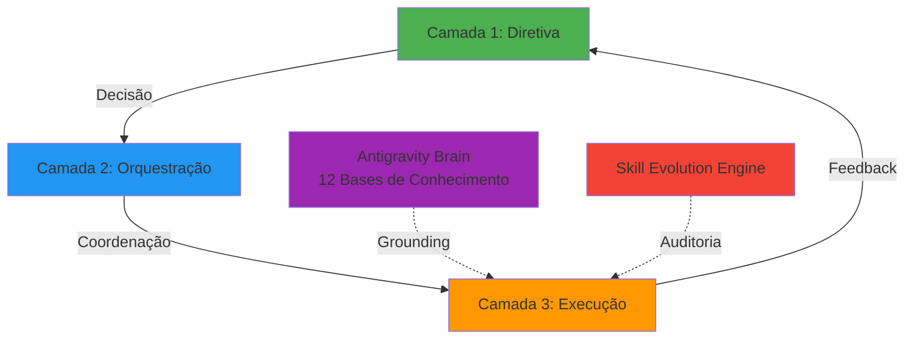
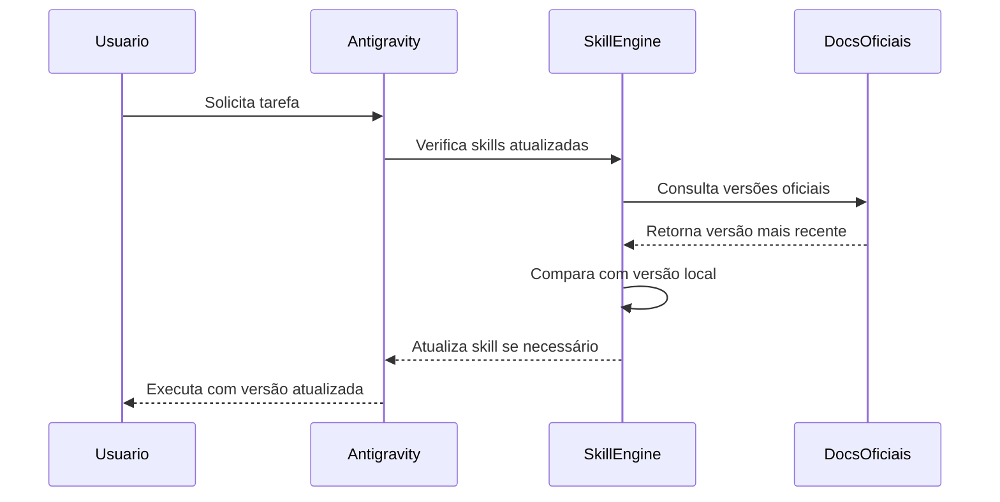

# 🚀 Antigravity Ecosystem

<div align="center">


**Arquitetura Eficiente e Retroalimentada (AER)**

*Sistema de IA modular e auto-evolutivo para empresas modernas*

---

[📖 Documentação](#-documentação) • 
[🛠️ Capacidades](#️-capacidades) • 
[🧠 Arquitetura](#-arquitetura) • 
[🚀 Como Usar](#-como-usar) • 
[📊 MCP Servers](#-mcp-servers)

</div>

---

## 🎯 Visão Geral

O **Antigravity Ecosystem** é uma arquitetura de IA empresarial que resolve dois problemas críticos da era digital:

1. **Obsolescência Tecnológica**: Sistemas tradicionais envelhecem rapidamente
2. **Alucinação de IA**: Modelos respondem com dados desatualizados

### O Diferencial AER

```
┌─────────────────────────────────────────┐
│   Sistema Auto-Evolutivo               │
│                                         │
│  ✓ Aprende sozinho (Retroalimentação)  │
│  ✓ Custa pouco (Eficiência)            │
│  ✓ É proprietário (Adaptável)          │
└─────────────────────────────────────────┘
```

---

## 🧠 Arquitetura do Sistema

### Arquitetura de 3 Camadas



### 🔹 Camada 1: **Diretiva** (O Estrategista)
- Recebe a intenção do usuário
- Decide qual especialista chamar
- Baixa alucinação, alta assertividade

### 🔹 Camada 2: **Orquestração** (O Gerente)
- Quebra tarefas em passos lógicos
- Coordena múltiplos agentes
- Garante integridade do processo

### 🔹 Camada 3: **Execução** (O Especialista)
- **530+ Skills especializadas**
- Cada skill faz UMA coisa perfeitamente
- Isolamento completo de contexto

---

## 🛠️ Capacidades do Sistema

### 📊 Estatísticas Gerais

| Categoria | Quantidade |
|-----------|------------|
| **Skills Especializadas** | 530+ |
| **Servidores MCP** | 7 ativos |
| **Bases de Conhecimento** | 12 lóbulos |
| **Fontes Oficiais** | 220+ documentações |
| **Ferramentas Nativas** | 15+ |

### 🎯 Módulos Principais

<details>
<summary><b>🤖 Inteligência & Autonomia</b></summary>

- Orquestração de Agentes (CrewAI, LangChain)
- Memória de Longo Prazo (RAG)
- Engenharia de Prompt Avançada
- Agentes Autônomos
- Voice AI & Computer Use Agents

</details>

<details>
<summary><b>💻 Desenvolvimento Fullstack & Mobile</b></summary>

- **Frontend**: React, Next.js, Vue, Angular, Svelte
- **Backend**: Node.js, Python, Go, Rust, Java, C#
- **Mobile**: Flutter, React Native, iOS/Swift, Android/Kotlin
- **Game Dev**: Unity, Unreal Engine, Godot

</details>

<details>
<summary><b>☁️ Cloud & DevOps</b></summary>

- **Cloud**: AWS, Azure, GCP, Multi-Cloud
- **Containers**: Docker, Kubernetes, Helm
- **IaC**: Terraform, Ansible, Pulumi
- **CI/CD**: GitHub Actions, GitLab CI, ArgoCD

</details>

<details>
<summary><b>🛡️ Cibersegurança</b></summary>

- **Pentest**: Kali Linux, Metasploit, Burp Suite
- **Web Security**: XSS, SQL Injection, IDOR, API Fuzzing
- **Cloud Security**: AWS/Azure/GCP Pentesting
- **Malware Analysis**: Reverse Engineering, Forensics

</details>

<details>
<summary><b>📈 Marketing & Growth</b></summary>

- SEO Avançado
- Copywriting & Content Marketing
- Paid Ads (Google, Meta, LinkedIn)
- Growth Hacking
- Analytics & BI

</details>

<details>
<summary><b>🔗 Blockchain & Web3</b></summary>

- Smart Contracts (Solidity)
- DeFi Protocols
- NFT Standards
- Web3 Security Audits

</details>

---

## 📊 MCP Servers Conectados

O Model Context Protocol (MCP) conecta o Antigravity a ferramentas e dados externos:

| Servidor | Descrição | Status |
|----------|-----------|--------|
| **context7** | Motor de busca de documentação técnica para qualquer framework | ✅ Ativo |
| **github-mcp-server** | Gestão completa do GitHub (repos, PRs, issues, workflows) | ✅ Ativo |
| **gmp-code-assist** | Google Maps Platform - documentação e implementação | ✅ Ativo |
| **notebooklm** | **Antigravity Brain** - 12 bases de conhecimento curadas | ✅ Ativo |
| **notion-mcp-server** | Gestão de páginas, databases e comentários no Notion | ✅ Ativo |
| **supabase-mcp-server** | Gestão de projetos Supabase, DB e edge functions | ✅ Ativo |
| **TestSprite** | Agente especialista em testes automáticos | ✅ Ativo |

---

## 🧠 Antigravity Brain

### 12 Lóbulos de Conhecimento

O sistema opera com **220+ fontes oficiais** organizadas em categorias:

```
📚 Knowledge Base Structure
│
├── 🤖 IA & Agentes (LangChain, CrewAI, RAG)
├── 🌐 Web Fullstack (React, Next.js, Node)
├── 📱 Mobile & Bots (Flutter, Telegram, WhatsApp)
├── 💾 Linguagens Core (Python, TypeScript, Rust, Go)
├── ☁️ Cloud & DevOps (AWS, Docker, K8s)
├── 🛡️ Segurança (Pentest, AppSec, NetSec)
├── 📊 Dados & Analytics (Data Eng, Vector DBs)
├── 📈 Marketing & Growth (SEO, Copy, Analytics)
├── 🎨 Product & Design (UX/UI, Figma, Product)
├── 🏗️ Engenharia de Software (Architecture, Patterns)
├── ⚙️ Automação & Workflows (n8n, Playwright)
└── 🔗 Blockchain & Web3 (Solidity, Ethereum)
```

### 🔍 Sistema de Grounding

Em vez de confiar na "memória" da IA, o Antigravity:

1. **Consulta fontes oficiais** via NotebookLM
2. **Valida informações** contra documentação técnica
3. **Atualiza conhecimento** automaticamente
4. **Elimina alucinações** com dados verificados

---

## 🚀 Como Usar

### Pré-requisitos

- Conta GitHub (para acesso aos repositórios)
- Antigravity CLI instalado
- Acesso aos servidores MCP configurados

### Comandos Básicos

```bash
# Consultar skills disponíveis
antigravity skills list

# Usar uma skill específica
antigravity use skill-name

# Atualizar o ecossistema
antigravity use skill-evolution-engine

# Criar nova skill
antigravity use skill-factory-universal
```

### 🎯 Casos de Uso

#### Desenvolvimento de Software
```bash
# Criar aplicação fullstack
antigravity build --stack nextjs,nodejs,postgres

# Adicionar autenticação
antigravity add auth --provider supabase
```

#### Cibersegurança
```bash
# Executar pentest
antigravity pentest --target example.com

# Análise de vulnerabilidades
antigravity scan --type web-vulnerabilities
```

#### Marketing & Growth
```bash
# Auditoria SEO
antigravity seo audit --url example.com

# Criar campanha de conteúdo
antigravity content create --topic "AI Tools"
```

---

## 🔄 Skill Evolution Engine

### Como Funciona o Auto-Update



### Vantagens

- ✅ **Zero obsolescência**: Sistema sempre atualizado
- ✅ **Sem intervenção manual**: Audita e atualiza automaticamente
- ✅ **Baseado em fontes oficiais**: Documentações técnicas verificadas
- ✅ **Versionamento inteligente**: Mantém histórico de mudanças

---

## 🏢 Adaptação para Negócios

### Protocolo de "Nichagem"

O Antigravity pode ser adaptado para qualquer nicho de mercado:

#### 🏥 Exemplo: Setor Médico

```yaml
Knowledge Swap:
  - Remove: "Docs de Python"
  - Insert: 
      - "Diretrizes Clínicas 2025"
      - "Bulas de Medicamentos"
      - "Protocolos Hospitalares"

Custom Skills:
  - diagnostico-por-sintomas
  - gerar-prescricao-medica
  - consultar-cid-10

Evolution Focus:
  - Monitor: "Novas regulações ANVISA"
  - Monitor: "Atualizações de protocolos médicos"
```

#### 🏠 Exemplo: Setor Imobiliário

```yaml
Knowledge Swap:
  - Remove: "Web Development Docs"
  - Insert:
      - "Código Civil - Locações"
      - "Plantas de Zoneamento"
      - "Tabela FIPE Imóveis"

Custom Skills:
  - avaliar-imovel-valor
  - gerar-contrato-locacao
  - buscar-zoneamento-prefeitura

Evolution Focus:
  - Monitor: "Mudanças em IPTU"
  - Monitor: "Novas leis de construção"
```

---

## 📚 Documentação

### Documentos Principais

- [📘 **AER Ecossistema**](./docs/AER_Ecossistema.md) - Fundamentos e arquitetura
- [📗 **Capacidades do Sistema**](./docs/Capacidades_Sistema_Antigravity.md) - Lista completa de skills
- [📙 **Documentação de Modelos IA**](./docs/Documentacao_Modelos_IA.md) - Guia de modelos de linguagem

### Guias Práticos

- 🎯 Como criar skills customizadas
- 🔧 Configuração de MCP servers
- 🧪 Testes e validação
- 🚀 Deploy em produção

---

## 🤝 Contribuindo

Este é um repositório corporativo. Para sugestões:

1. Abra uma issue descrevendo a melhoria
2. Aguarde análise do time técnico
3. Pull requests são bem-vindos após aprovação

---

## 📄 Licença

Propriedade de **Cadelcayt Coder** - Todos os direitos reservados.

Este sistema é proprietário e foi desenvolvido para uso empresarial interno.

---

## 📞 Contato

**Julio Pereira Cadelca**
- 📧 Email: cadelcayt@gmail.com
- 🔗 GitHub: [@cadelcayt-coder](https://github.com/cadelcayt-coder)

---

<div align="center">

**Feito com ❤️ pelo Antigravity Ecosystem**

*"Sistema que aprende, evolui e nunca envelhece"*

</div>